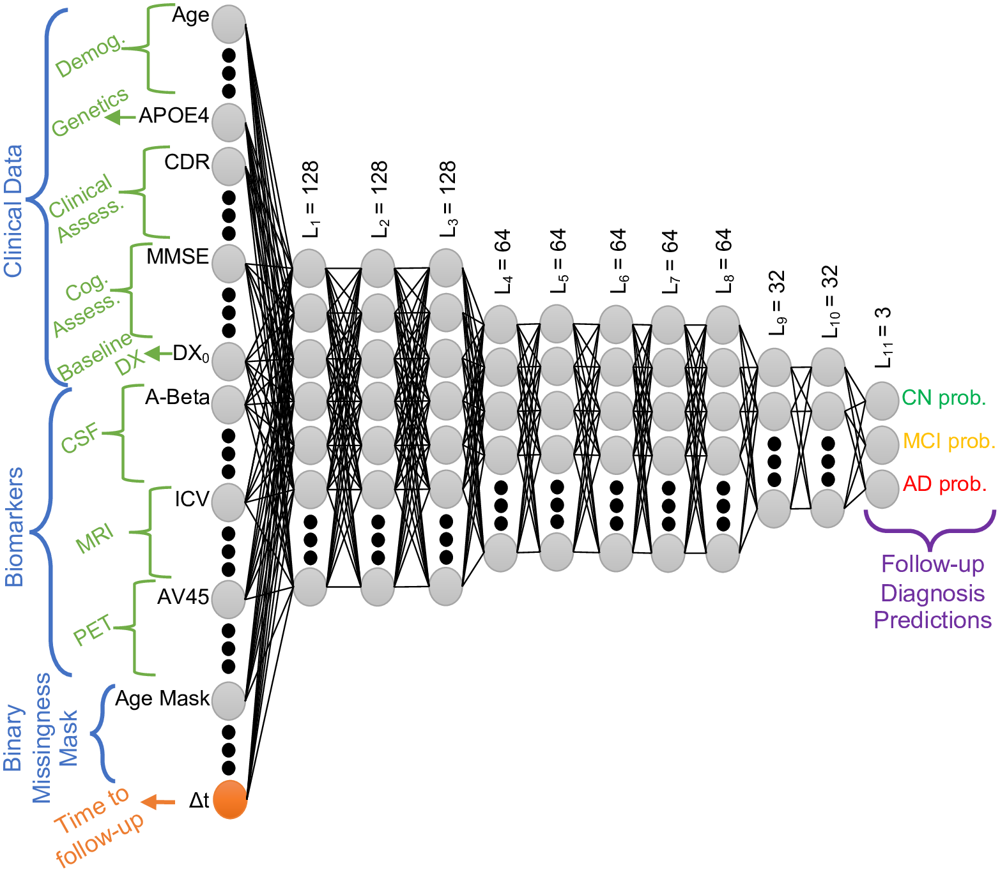
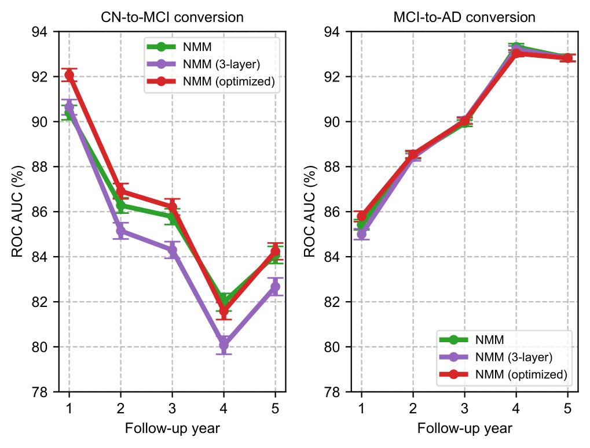

# About

Data preprocessing code for the paper [_Machine learning based multi-modal prediction of future decline toward Alzheimer’s disease: An empirical study_](https://journals.plos.org/plosone/article?id=10.1371/journal.pone.0277322), where we present an empirical study to characterize how predictable individual subjects’ future Alzheimer's Disease trajectory is, several years in advance, based on rich multi-modal data, and using modern deep learning methods.



The raw data files used in this work are 'ADNIMERGE.csv' and 'ADNIMERGE_DICT.csv', and were obtained from the Alzheimer’s Disease Neuroimaging Initiative (ADNI) database [https://adni.loni.usc.edu](https://adni.loni.usc.edu). Applications for ADNI data use can be submitted through the ADNI website at [https://adni.loni.usc.edu/data samples/accessdata/](https://adni.loni.usc.edu/data-samples/accessdata/). You would be able to access the data in the same manner as us. We did not have any special access privileges that others would not have.

We note that ADNI database, hence 'ADNIMERGE.csv', is updated with the addition of new subjects and follow-up visits regularly. Therefore, even if you choose the same participant selection criteria as ours, there will be minor differences in subject characteristics, number of available follow-up visits, and data missingness.

## Preprocessing

Our preprocessing pipeline consists of several steps. The first step is where we take care of the fundamental misconceptions in the data. In the second and third steps, we extract subjects' disease progression trajectories and perform participant selection. In the forth step, we split the data into multiple training/validation/test splits in a stratified fashion, since the follow-up diagnosis are unbalanced. Finally, we process the input features (imputation, masking, z-score normalization, etc.). Each step has its own '.py' file.

Command for preprocessing ADNI data:

```
python preprocessing.py \
  --path_to_read out / \ # The directory containing the ADNIMERGE_DICT.csv and ADNIMERGE.csv files. 
  --r_test \ # Desired test set ratio (between 0 and 1)
  --r_val \ # Desired validation set ratio (between 0 and 1)
  --N_RT 200 \ # Number of random train/test splits.
  --N_RV 5 \ # Number of random train/val splis for each train/test split.
  --seed 1337 \ # Seed for random number generation.
```

## Training

Command for training NMM with paper's hyperparameters:

```
python train.py \
  --N_RT 200 \ # Number of random train/test splits.
  --N_RV 5 \ # Number of random train/val splis for each train/test split.
  --N_RI 5 \ # Number of random initializations for each train/val split.
  --root out / \ # Root directory.
  --model_name NMM \ # Name of the model.
  --model_width 128 \ # The model width.
  --model_depth 3 \ # The model depth.
  --dropout_rate 0.2 \ # Dropout rate for regularization.
  --batch_size 32 \ # Batch size for training.
  --seed 1337 \ # Seed for random number generation.
  --learning_rate 1e-5 \ # Learning rate for Adam.
  --weight_decay 1e-6 \ # Weight decay for Adam.
```

Add command `--write_tensorboard` to save the learning curves to Tensorboard. The hyperparameters are not optimal and can be tuned further as in this figure.


## Evaluation

The script is set up to run all test modes reported in the paper.

Command for evaluating NMM with paper's hyperparameters:

```
python eval.py \
  --N_RT 200 \ # Number of random train/test splits.
  --N_RV 5 \ # Number of random train/val splis for each train/test split.
  --N_RI 5 \ # Number of random initializations for each train/val split.
  --root out / \ # Root directory.
  --model_name NMM \ # Name of the model.
  --model_width 128 \ # The model width.
  --model_depth 3 \ # The model depth.
  --batch_size 32 \ # Batch size for training.
  --seed 1337 \ # Seed for random number generation.
```

## Requirements

This code was run and tested on an Nvidia TITAN RTX GPU with the following dependencies:

+ python 3.8.16
+ torch 1.12.1+cu102
+ tensorboard 2.11.2
+ scikit-learn 1.2.1
+ pandas 1.5.3
+ numpy 1.24.1

# Citation

We encourage researchers to use our preprocessing pipeline for their work, so that we can have a cumulatively growing literature on early prediction of Alzheimer's. We would like our paper to serve as a foundation for others to improve upon. If you use our code, please cite:

```bash
@article{karaman_2022_machine,
  author = {Karaman, Batuhan K. and Mormino, Elizabeth C. and Sabuncu, Mert R.},
  editor = {Thung, Kim Han},
  month = {11},
  pages = {e0277322},
  title = {Machine learning based multi-modal prediction of future decline toward Alzheimer’s disease: An empirical study},
  doi = {10.1371/journal.pone.0277322},
  urldate = {2022-12-02},
  volume = {17},
  year = {2022},
  journal = {PLOS ONE}
} 
```
